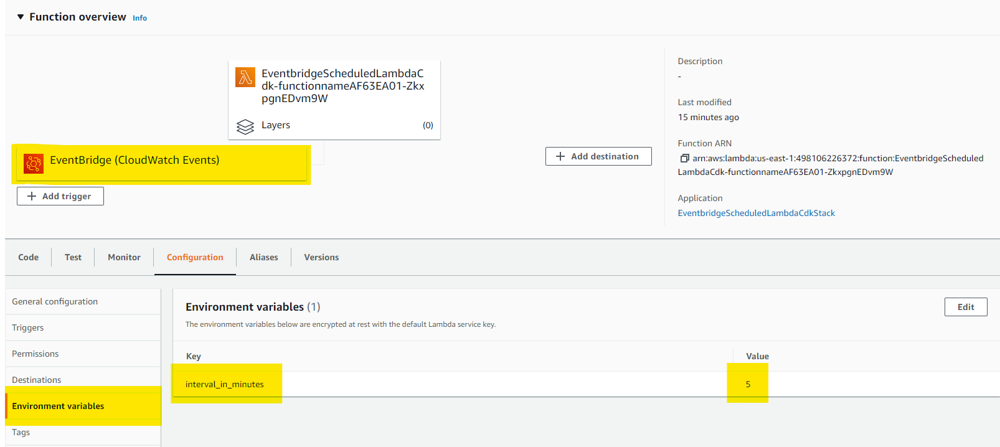
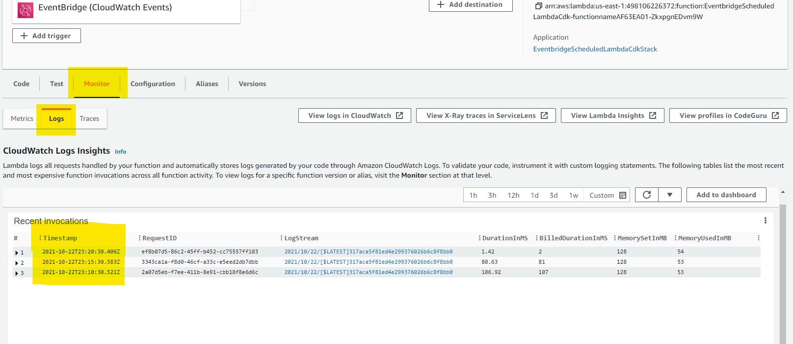

# AWS EventBridge to AWS Lambda

This CDK pattern deploys an infrastructure on AWS with Custom Scheduled EventBridge Rule that trigger a lambda function that get as environment variable the value assigned to the interval (in minutes) that the lambda will run

Learn more about this pattern at Serverless Land Patterns: << Add the live URL here >>

Important: this application uses various AWS services and there are costs associated with these services after the Free Tier usage - please see the [AWS Pricing page](https://aws.amazon.com/pricing/) for details. You are responsible for any AWS costs incurred. No warranty is implied in this example.

## Requirements

* [Create an AWS account](https://portal.aws.amazon.com/gp/aws/developer/registration/index.html) if you do not already have one and log in. The IAM user that you use must have sufficient permissions to make necessary AWS service calls and manage AWS resources.
* [AWS CLI](https://docs.aws.amazon.com/cli/latest/userguide/install-cliv2.html) installed and configured
* [Git Installed](https://git-scm.com/book/en/v2/Getting-Started-Installing-Git)
* [AWS Serverless Application Model](https://docs.aws.amazon.com/serverless-application-model/latest/developerguide/serverless-sam-cli-install.html) (AWS SAM) installed
* [AWS CDK] (https://docs.aws.amazon.com/cdk/api/latest/)

## Deployment Instructions

1. Create a new directory, navigate to that directory in a terminal and clone the GitHub repository:
    ``` 
    git clone https://github.com/aws-samples/serverless-patterns
    ```
1. Change directory to the pattern directory:
    ```
    cd _patterns-model
    ```
1. From the command line, use AWS SAM to deploy the AWS resources for the pattern as specified in the template.yml file:
    ```
    cdk deploy --context interval_in_minutes=<number>
    example: cdk deploy --context interval_in_minutes=5
    ```
1. During the prompts:
    * Do you wish to deploy these changes (y/n)?
    answer: y <enter>

## How it works

After the deployment is complete the lambda function will run on interval of minutes you passed as --context.
You can check the lambda configuration / environment variables
you can also see the lambda trigger

on the monitor tab / Logs you can see recent invocations inteval

On View logs in CloudWatch you can see the lambda output as defined in our lambda code using:
console.log("This function runs every " + interval_in_minutes + " minutes")


## Testing

check the Lambda logs. You should see the following message in the log:
"This function runs every x minutes"

## Cleanup
 
1. Delete the stack
    ```bash
    aws cloudformation delete-stack --stack-name STACK_NAME
    ```
1. Confirm the stack has been deleted
    ```bash
    aws cloudformation list-stacks --query "StackSummaries[?contains(StackName,'STACK_NAME')].StackStatus"
    ```
1. or delete the stack using the AWS Cloudformation console
----
Copyright 2021 Amazon.com, Inc. or its affiliates. All Rights Reserved.

SPDX-License-Identifier: MIT-0