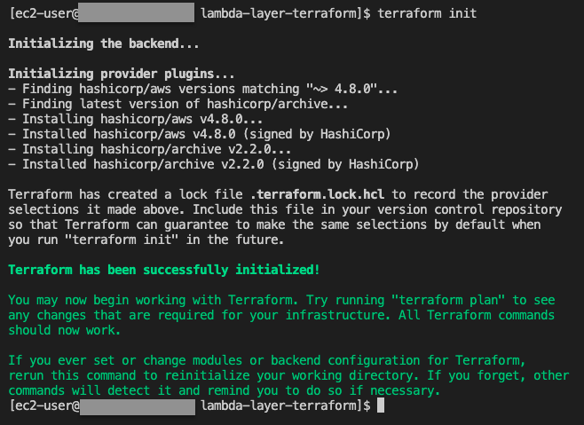
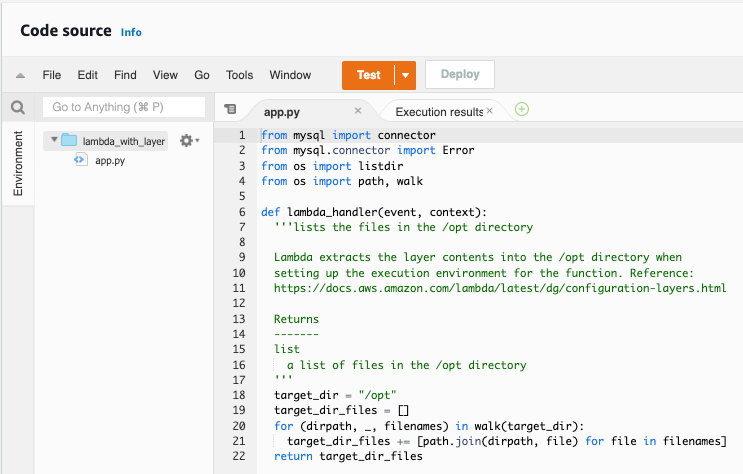
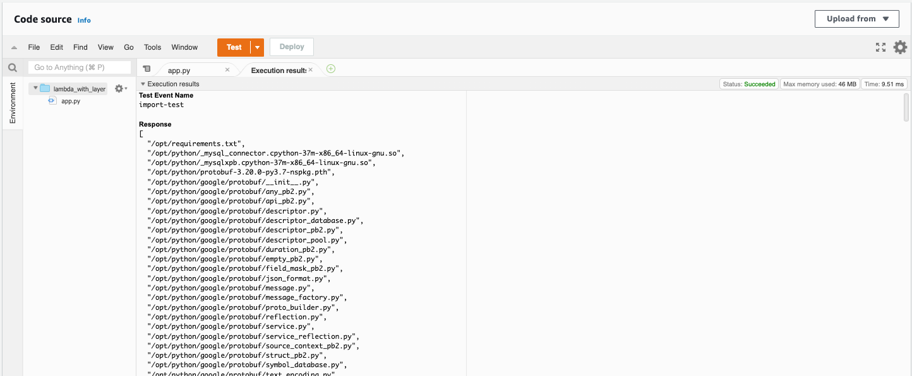

# AWS Lambda Layer Terraform - Import packages from a layer

This pattern shows how to deploy a Lambda Function that has a layer added to it.

This demo deploys two Lambda functions using Terraform. Both Lambda functions attempt to import the `mysql-connector-python` package. However, only one of the Lambda functions has the layer which allows it to import the package successfully. This pattern tests both Lambda functions to illustrate the difference when there is a layer added to a Lambda function. For more information on Lambda Layers, please refer to [AWS Lambda Developer Guide: Creating and sharing Lambda layers](https://docs.aws.amazon.com/lambda/latest/dg/configuration-layers.html)

Learn more about this pattern at Serverless Land Patterns: https://serverlessland.com/patterns/lambda-layer-terraform

Important: this application uses various AWS services and there are costs associated with these services after the Free Tier usage - please see the [AWS Pricing page](https://aws.amazon.com/pricing/) for details. You are responsible for any AWS costs incurred. No warranty is implied in this example.

## Requirements

* [Create an AWS account](https://portal.aws.amazon.com/gp/aws/developer/registration/index.html) if you do not already have one and log in. The IAM user that you use must have sufficient permissions to make necessary AWS service calls and manage AWS resources.
* [AWS CLI](https://docs.aws.amazon.com/cli/latest/userguide/install-cliv2.html) installed and configured
* [Git Installed](https://git-scm.com/book/en/v2/Getting-Started-Installing-Git)
* [Terraform Installed](https://learn.hashicorp.com/tutorials/terraform/install-cli?in=terraform/aws-get-started)
* [Python Installed](https://www.python.org/downloads/)

## Deployment Instructions

1. Create a new directory, navigate to that directory in a terminal and clone the GitHub repository:

    ```bash
    git clone https://github.com/aws-samples/serverless-patterns
    ```
2. Change directory to the pattern directory:

    ```bash
    cd lambda-layer-terraform
    ```

3. To reduce the size of the files pushed to GitHub, this pattern does not include the `mysql-connector-python` package. Instead, install the package by changing your directory to the `./dependencies/mysql-connector-python` and install the package. Assuming you are in the demo directory after step 2, run the following commands:

    ```bash
    cd dependencies/mysql-connector-python
    pip3 install -r requirements.txt --target ./python
    ```

    

4. Go back to the demo directory where the `main.tf` file resides

   ```bash
   cd ../..
   ```

   

5. From the command line, initialize terraform to download and install the providers defined in the configuration:

    ```bash
    terraform init
    ```

    

6. From the command line, apply the configuration in the main.tf file. 4 resources are created for this demo:

    ```bash
    terraform apply --auto-approve
    ```

    

## How it works

The Terraform code deploys the following resources:

| Resource                                   | Type                     | Description                                                  |
| ------------------------------------------ | ------------------------ | ------------------------------------------------------------ |
| IAM Role for Lambda functions              | aws_iam_role             | Managed policy for AWSLambdaBasicExecutionRole               |
| mysql-connector-python package             | aws_lambda_layer_version | Reference: [pypi: mysql-connector-python](https://pypi.org/project/mysql-connector-python/) |
| Lambda Function with the Layer attached    | aws_lambda_function      | This Lambda has the layer attached and can successfully import the package |
| Lambda Function without the Layer attached | aws_lambda_function      | This Lambda does not have layer attached and does not successfully import the package |

==============================================

## Testing

Test the Lambda Function that has the layer - it executes successfully

1. Navigate to the Lambda console and select the `lambda_with_layer` function, then choose `Test` (next to the `Deploy` button)

    


2. Give the test an `Event name` and choose `Save`

    

3. Then choose `Test` again from the console. The `Execution results` shows that the Lambda Function runs succesfully.

    

Test the Lambda Function that does not have the layer - it results in an error

1. Navigate to the Lambda console and select the `lambda_without_layer` function, then choose `Test` (next to the `Deploy` button)

    

2. Give the test an `Event name` and choose `Save`

    

3. Then choose `Test` again from the console. The `Execution results` shows that there is an error of `Unable to import module 'app': No module named 'mysql'`. This is expected since this Lambda function does not have the layer with `mysql-connector-python`

    

## Cleanup

1. Delete all created resources by terraform

    ```bash
    terraform destroy --auto-approve
    ```
    

2. Confirm all created resources has been deleted

    ```bash
    terraform show
    ```

    

----
Copyright 2022 Amazon.com, Inc. or its affiliates. All Rights Reserved.

SPDX-License-Identifier: MIT-0
