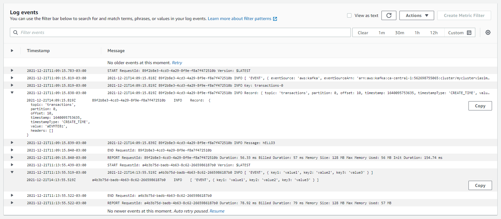

# S3 to Lambda

This CDK stack deploys a Lambda function, an Amazon MSK topic, and the minimum IAM resources required to run the application.

When items are published to the Amazon MSK topic, the changes are sent to a stream. This pattern configures a Lambda function to poll this stream, and log some information to CloudWatch. The function is invoked with a payload containing the information of the event.

Important: this application uses various AWS services and there are costs associated with these services after the Free Tier usage - please see the [AWS Pricing page](https://aws.amazon.com/pricing/) for details. You are responsible for any AWS costs incurred. No warranty is implied in this example.

## Requirements

- [Create an AWS account](https://portal.aws.amazon.com/gp/aws/developer/registration/index.html) if you do not already have one and log in. The IAM user that you use must have sufficient permissions to make necessary AWS service calls and manage AWS resources.
- [AWS CLI](https://docs.aws.amazon.com/cli/latest/userguide/install-cliv2.html) installed and configured
- [Node and NPM](https://nodejs.org/en/download/) installed
- [Git Installed](https://git-scm.com/book/en/v2/Getting-Started-Installing-Git)
- [AWS Cloud Development Kit](https://docs.aws.amazon.com/cdk/latest/guide/getting_started.html#getting_started_install) (AWS CDK) installed

## Deployment Instructions

1. Create a new directory, navigate to that directory in a terminal and clone the GitHub repository:
   ```sh
   git clone https://github.com/aws-samples/serverless-patterns
   ```
1. Change directory to the pattern directory:
   ```sh
   cd msk-lambda-cdk/src
   ```
1. From the command line, use npm to install dependencies:
   ```sh
   npm install
   ```
1. Finally, use AWS CDK to deploy the AWS resources for the pattern as specified in the `lib/msk-to-lambda-cdk-stack.ts` file:

   ```sh
   cdk deploy
   ```

1. Note the outputs from the SAM deployment process. These contain the resource names and/or ARNs which are used for testing.

## Testing

1. Publish messages to the Amazon MSK topic. Follow the steps as outlined in Step 4 to create a client machine and publish messages to the MSK Topic.
2. Retrieve the logs from the Lambda function:

```bash
sam logs -n ENTER_YOUR_CONSUMER_FUNCTION_NAME
```

## Documentation

- [Using Lambda with Amazon MSK](https://docs.aws.amazon.com/lambda/latest/dg/with-msk.html)
- [Using Amazon MSK as an event source for AWS Lambda](https://aws.amazon.com/blogs/compute/using-amazon-msk-as-an-event-source-for-aws-lambda/)

#TODO: ## Add image showing cloudwatch logs

<!--  -->

## Cleanup

1. Delete the stack
   ```bash
   cdk destroy
   ```
1. Confirm the stack has been deleted
   ```bash
   aws cloudformation list-stacks --query "StackSummaries[?contains(StackName,'STACK_NAME')].StackStatus"
   ```

---

Copyright 2021 Amazon.com, Inc. or its affiliates. All Rights Reserved.

SPDX-License-Identifier: MIT-0
